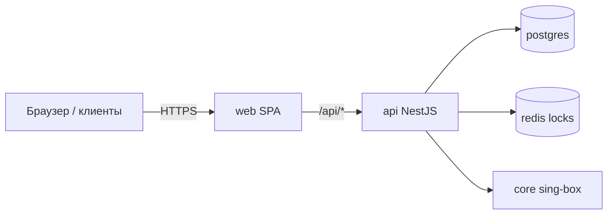

# Contributing to OverVPN

Гайд для тех, кто лезет в код: что за система, из чего состоит, как процессы связаны, какие зависимости где живут и как поднять локальный контур.

Пользовательская установка и эксплуатация — в [README.md](README.md).

---

## Оглавление

1. [Что это за система](#1-что-это-за-система)
2. [Карта репозитория](#2-карта-репозитория)
3. [Стек и зависимости](#3-стек-и-зависимости)
4. [Архитектура рантайма](#4-архитектура-рантайма)
5. [API: модули и зоны ответственности](#5-api-модули-и-зоны-ответственности)
6. [Ядро sing-box: apply / reload / rollback](#6-ядро-sing-box-apply--reload--rollback)
7. [Воркеры](#7-воркеры)
8. [Модель данных (Prisma)](#8-модель-данных-prisma)
9. [Web-панель](#9-web-панель)
10. [`@overvpn/shared`](#10-overvpnshared)
11. [Локальная разработка](#11-локальная-разработка)
12. [Тесты, линт, формат](#12-тесты-линт-формат)
13. [Docker / Compose / образы](#13-docker--compose--образы)
14. [CI / GHCR / self-hosted runner](#14-ci--ghcr--self-hosted-runner)
15. [Установщик `install.sh`](#15-установщик-installsh)
16. [Соглашения по изменениям](#16-соглашения-по-изменениям)

---

## 1. Что это за система

OverVPN — **control plane** над одним процессом **sing-box** на одной машине.



Панель **не** маршрутизирует клиентский VPN-трафик сама. Она:

- хранит пользователей, inbound’ы, планы, assignments;
- рендерит desired-конфиг sing-box и применяет его атомарно;
- отдаёт subscription-профили клиентам;
- собирает трафик/онлайн через Clash API + V2Ray Stats API;
- enforce’ит лимиты и пишет audit.

**Не делаем:** мульти-нода, федерация, шардинг ядра, «панель как прокси».

---

## 2. Карта репозитория

```text
OverVPN/
├── apps/
│   ├── api/                 # NestJS control plane (@overvpn/api)
│   │   ├── prisma/          # schema + migrations
│   │   ├── src/
│   │   │   ├── auth/ … users/ inbounds/ core/ workers/ …
│   │   │   ├── config/      # Zod-валидация env
│   │   │   ├── common/      # guards, errors, interceptors
│   │   │   └── scripts/     # bootstrap-admin
│   │   └── test/            # e2e
│   └── web/                 # React + Vite + Ant Design (@overvpn/web)
├── packages/
│   └── shared/              # Zod-схемы и константы (@overvpn/shared)
├── deploy/
│   ├── docker-compose.yml   # прод-стек
│   ├── proxy/               # пример Nginx
│   ├── landing/             # HTML-заглушки для доменов
│   └── sing-box/            # entrypoint, bootstrap config, certs/
├── scripts/
│   └── install-github-runner.sh
├── install.sh               # прод-установщик + CLI `overvpn`
├── package.json             # pnpm workspace root + turbo scripts
├── turbo.json
└── Makefile                 # тонкие обёртки над pnpm
```

Workspace (`pnpm-workspace.yaml`):

- `apps/*`
- `packages/*`

Оркестрация задач: **Turborepo** (`turbo run …`). Сборка пакетов идёт по графу `dependsOn: ["^build"]` — сначала `shared`, потом потребители.

---

## 3. Стек и зависимости

### Runtime / tooling (корень)

| Что | Версия / пакет | Зачем |
| --- | --- | --- |
| Node.js | `>=24 <25` | runtime |
| pnpm | `11.12.0` (`packageManager`) | monorepo |
| Turbo | `^2.10` | parallel build/dev/test |
| TypeScript | `^6` | общий toolchain |
| Prettier | `^3.9` | единый формат |

### `@overvpn/api`

| Слой | Пакеты |
| --- | --- |
| HTTP framework | `@nestjs/common/core/platform-express` `^11` |
| Config | `@nestjs/config` + **Zod** (`validateEnvironment`) |
| Auth | `@nestjs/jwt`, `argon2`, `otplib` (TOTP), `cookie-parser` |
| DB | `prisma` / `@prisma/client` `^7`, `@prisma/adapter-pg`, `pg` |
| Cache / locks | `ioredis` |
| Logging | `pino`, `nestjs-pino`, `pino-http` |
| Validation (DTO) | `class-validator` + `class-transformer` |
| Docs | `@nestjs/swagger` (флаг `SWAGGER_ENABLED`) |
| Rate limit | `@nestjs/throttler` |
| gRPC (V2Ray stats) | `@grpc/grpc-js`, `@grpc/proto-loader` |
| Misc | `helmet`, `yaml`, `rxjs` |
| Shared contracts | `@overvpn/shared` (workspace) |

Тесты API: **Jest** + `ts-jest` + `supertest` (e2e).

### `@overvpn/web`

| Слой | Пакеты |
| --- | --- |
| UI | React `19`, Ant Design `5`, `@ant-design/icons/charts` |
| Router | `react-router-dom` `7` |
| Data | `@tanstack/react-query` `5` |
| i18n | `i18next` + `react-i18next` (RU default / EN) |
| Build | Vite `8`, `@vitejs/plugin-react` |
| Lint | **oxlint** (не ESLint) |
| Tests | **Vitest** |
| QR | `qrcode.react` |

### `@overvpn/shared`

Только **Zod** + TypeScript. Сюда кладём контракты, которые должны совпадать у API и web (статусы, схемы ответов/запросов, константы).

### Инфраструктура (Compose)

| Сервис | Образ / бинарь | Роль |
| --- | --- | --- |
| `postgres` | `postgres:18-alpine` | состояние панели |
| `redis` | `redis:8-alpine` | throttle, distributed locks воркеров/apply |
| `migrate` | api image, one-shot | `prisma migrate deploy` |
| `api` | `ghcr.io/overl1te/overvpn-api` | NestJS |
| `web` | `ghcr.io/overl1te/overvpn-web` | Nginx + SPA, proxy `/api` |
| `core` | sing-box в контейнере | VPN data plane |
| `bootstrap-admin` | profile `tools` | создать OWNER |

---

## 4. Архитектура рантайма

### Потоки данных

| Поток | Путь | Примечание |
| --- | --- | --- |
| Админ UI | Browser → web → `POST/GET /api/admin/*` → Nest | JWT access + httpOnly refresh cookie |
| Подписка | Client → `GET /api/sub/:token` → SubscriptionsModule | без админ-JWT; rate-limit по IP и fingerprint токена |
| Apply конфига | Admin mutation / auto-after-save → CoreModule → файл + reload handshake → sing-box | Redis lock `CORE_APPLY_LOCK_TTL_MS` |
| Трафик | Worker → V2Ray Stats gRPC → ledger → агрегация UsageDaily | epoch/generation после reload |
| Онлайн | Worker → Clash API → OnlineSession | best-effort device id |
| Enforce | Worker → статусы User (`LIMITED`/`EXPIRED`/…) → re-apply при необходимости | |

### Сети Compose (упрощённо)

- **backend** — postgres, redis, api, core (внутренние порты Clash/V2Ray не торчат наружу без нужды).
- **web** слушает на `WEB_BIND_ADDRESS:WEB_PORT` (часто `127.0.0.1:8080`), снаружи — Nginx из `install.sh`.

### Секреты

- `SECRETS_MASTER_KEY` (ровно 64 hex) — шифрование protocol secrets и backup payloads.
- `JWT_ACCESS_SECRET` — access tokens.
- `SING_BOX_CLASH_API_SECRET` — Clash API ядра.
- Пароли БД/Redis — отдельные; в URL должны совпадать с `POSTGRES_PASSWORD` / `REDIS_PASSWORD`.

Env валидируется при старте API в `apps/api/src/config/environment.ts`. Невалидный `.env` = процесс не поднимется.

---

## 5. API: модули и зоны ответственности

Точка входа: `apps/api/src/main.ts` → `AppModule`.

Глобально:

- `JwtAuthenticationGuard` + `RolesGuard` (`OWNER` / `ADMIN` / `READONLY`)
- `ApiExceptionFilter`
- `BigIntSerializationInterceptor` (Prisma `BigInt` → JSON)
- Pino с redact секретов (пароли, cookie, PEM, obfs, …)
- `ThrottlerModule` для login window

| Модуль | Каталог | Зачем |
| --- | --- | --- |
| **Infrastructure** | `infrastructure/` | Prisma, Redis клиенты |
| **Auth** | `auth/` | login/refresh/logout, TOTP, bootstrap-совместимая модель AdminUser |
| **Users** | `users/` | CRUD пользователей, assignments, rotate-sub, статусы |
| **Plans** | `plans/` | тарифы / шаблоны лимитов и привязка inbound’ов |
| **Inbounds** | `inbounds/` | протоколы Hysteria2 / VLESS Reality / Trojan / SS, settings |
| **Subscriptions** | `subscriptions/` | публичные профили `sing-box` / `clash` / `links` / `info` |
| **Core** | `core/` | абстракция `CoreProvider`, `SingBoxProvider`, diff/apply/health/stats |
| **Workers** | `workers/` | фоновые циклы (см. ниже) |
| **System** | `system/` | dashboard snapshots, health агрегаты |
| **Settings** | `settings/` | SystemConfig (Telegram и пр.; секреты не отдаются наружу) |
| **Backups** | `backups/` | DATABASE / CORE_CONFIG / FULL, encrypt, restore (OWNER) |
| **Audit** | `audit/` | журнал админ-действий |
| **Health** | `health/` | `/api/health`, `/api/health/ready` |
| **Notifications** | `notifications/` | Telegram (EN/RU) при enforcement / core-apply fail |

Паттерн типичного feature-модуля:

```text
*.module.ts
*.controller.ts      # HTTP
*.service.ts         # бизнес-логика
*.dto.ts / validators
*.spec.ts            # unit
```

Роли режутся декораторами в `common/authorization`. `READONLY` не должен получать мутирующие эндпоинты; web дополнительно прячет UI через `MutateOnly`.

---

## 6. Ядро sing-box: apply / reload / rollback

Ключевой файл: `apps/api/src/core/sing-box.provider.ts` (`SingBoxProvider extends CoreProvider`).

### Desired state

Панель собирает desired inbounds + users/credentials из БД → рендерит JSON конфиг → canonical JSON + hash (для diff/audit без утечки секретов: `redactJson` / `redactText` в `core-config-utils`).

### Apply pipeline (концептуально)

```text
acquire Redis lock
  → validate config (sing-box check)
  → write config.json
  → signal reload (request/ack handshake через файлы в /var/lib/overvpn/reload)
  → verify health (Clash API)
  → persist CoreApplyRecord + update CoreState / last-known-good
on failure
  → restore previous config
  → reload again
  → mark apply FAILED
```

В Compose пути задаются так (см. `deploy/docker-compose.yml`):

| Env | Назначение |
| --- | --- |
| `SING_BOX_BINARY_PATH` | бинарь |
| `SING_BOX_CONFIG_PATH` | живой конфиг |
| `SING_BOX_LAST_KNOWN_GOOD_PATH` | откат |
| `SING_BOX_RELOAD_REQUEST_PATH` / `_ACK_PATH` | handshake с entrypoint ядра |
| `SING_BOX_CLASH_API_URL` | health / online |
| `SING_BOX_V2RAY_API_ADDRESS` | traffic counters |

Entrypoint ядра: `deploy/sing-box/entrypoint.sh` — слушает reload-request и шлёт SIGHUP/рестарт по контракту панели.

### Важные инварианты

1. После reload **счётчики V2Ray API сбрасываются** → accounting хранит generation/epoch (`TrafficCursor` / checkpoints), иначе двойной учёт или дыры.
2. Трафик в stats API — **per-user aggregate**, не per-(user, inbound).
3. Бинарь должен быть собран с нужными tags (`with_v2ray_api`, Clash, QUIC, ACME).

Если меняешь формат конфига или handshake — синхронно правь **provider + entrypoint + тесты** (`sing-box.provider.spec.ts` и соседние).

---

## 7. Воркеры

Модуль: `apps/api/src/workers/`.

Включаются флагом `WORKERS_ENABLED=true`. В unit/e2e/one-shot скриптах и migrate-контейнере держи **`false`**, иначе фоновые циклы мешают тестам и гоняются за lock’ами.

| Сервис | Роль | Интервалы (env) |
| --- | --- | --- |
| `WorkerSchedulerService` | регистрация тиков | — |
| `TrafficCollectorService` | снимок counters → deltas/ledger | `TRAFFIC_COLLECTION_INTERVAL_MS` |
| `DailyUsageAggregatorService` | агрегация в `UsageDaily` | `TRAFFIC_AGGREGATION_*` |
| `OnlineSessionCollectorService` | активные клиенты | `ONLINE_COLLECTION_INTERVAL_MS` |
| `OnlineSessionSweeperService` | закрытие протухших сессий | `ONLINE_SWEEP_INTERVAL_MS`, `ONLINE_SESSION_TIMEOUT_MS` |
| `LimitEnforcerService` | expire / quota / device / IP → статусы + side effects | `ENFORCEMENT_INTERVAL_MS` |
| `WorkerHealthService` | статусы для dashboard | — |

Распределённые lock’и через Redis (`WORKER_LOCK_TTL_MS`), чтобы при случайном втором инстансе API не дублировать работу (в проде всё равно ожидается один api-контейнер).

Чистая логика учёта/enforce вынесена в `traffic-accounting.ts`, `limit-enforcement.ts` — удобно тестировать без Nest.

---

## 8. Модель данных (Prisma)

Схема: `apps/api/prisma/schema.prisma`.

### Основные сущности

| Model | Смысл |
| --- | --- |
| `AdminUser` / `RefreshToken` | админы и сессии |
| `User` | VPN-пользователь, лимиты, статус, sub token |
| `Plan` / `PlanInbound` | тариф и набор inbound’ов |
| `Inbound` | слушатель протокола + encrypted settings |
| `UserInboundAssignment` | credentials пользователя на inbound |
| `UsageDaily` | дневная агрегация трафика |
| `TrafficCursor` / `TrafficDelta` / `TrafficCheckpoint` | ledger с учётом reload epoch |
| `OnlineSession` | онлайн/история |
| `AuditLog` | действия админов |
| `SystemConfig` | key/value настроек |
| `CoreApplyRecord` / `CoreState` | история apply и текущее поколение конфига |
| `BackupArtifact` | метаданные бэкапов |

Миграции только через Prisma:

```bash
pnpm migrate:dev     # локально: создать миграцию
pnpm migrate         # deploy (прод / CI / compose migrate job)
pnpm prisma:generate
```

Не правь SQL миграции вручную после merge в `master`, если нет крайней необходимости — ломает историю на чужих инсталлах.

---

## 9. Web-панель

`apps/web` — SPA.

```text
src/
├── api/           # тонкие клиенты под ресурсы (/users, /inbounds, …)
├── auth/          # AuthContext (login/refresh)
├── components/    # StatusTag, QrModal, MutateOnly, …
├── i18n/          # RU/EN
├── layout/        # AdminLayout + nav
├── pages/         # dashboard, users, inbounds, plans, config, …
└── App.tsx        # routes
```

Маршруты зеркалят домен:

| Path | Страница |
| --- | --- |
| `/login` | LoginPage |
| `/dashboard` | DashboardPage |
| `/users`, `/users/:id` | список / карточка + sub QR |
| `/inbounds` | inbound’ы |
| `/plans` | планы |
| `/online` | сессии |
| `/config` | preview/apply |
| `/audit` | журнал |
| `/system` | settings + system |
| `/backups` | бэкапы |

В dev Vite проксирует `/api` → `:3000`. В проде тот же path обслуживает Nginx внутри web-образа (`apps/web/nginx.conf`).

i18n: не хардкодь пользовательские строки в JSX — ключи в словарях. Ошибки API с runtime-локализацией — через `localizeRuntimeError`.

---

## 10. `@overvpn/shared`

`packages/shared/src/`:

- `constants.ts` — общие константы/enum-совместимые значения
- `schemas.ts` — Zod-схемы контрактов
- `index.ts` — реэкспорт

Правило: **если поле видит и API, и web — оно должно жить в shared**, а не копипаститься. После изменения shared нужна сборка (`pnpm --filter @overvpn/shared build` или просто `pnpm build` / `pnpm dev`, turbo подтянет `^build`).

Exports:

```json
"." / "./constants" / "./schemas"
```

---

## 11. Локальная разработка

### Вариант A — полный Compose (ближе к проду)

```bash
cp .env.example .env
# заполни REPLACE_*; для локалки:
#   CORS_ORIGINS=http://localhost:8080
#   SUB_PUBLIC_BASE_URL=http://localhost:8080
#   AUTH_COOKIE_SECURE=false

pnpm compose-build
docker compose --env-file .env -f deploy/docker-compose.yml --profile tools run --rm bootstrap-admin
# → http://localhost:8080
```

### Вариант B — native API + web (быстрый фидбек)

Нужны локально:

- PostgreSQL
- Redis
- бинарь **sing-box** (совместимая сборка; в комментариях `.env.example` фигурирует линия 1.13.x)
- пути к config / last-known-good / reload files

```bash
pnpm install
pnpm prisma:generate

# .env в корне: DATABASE_URL/REDIS_URL на localhost,
# SING_BOX_* пути раскомментированы под твою ОС

pnpm migrate
pnpm bootstrap:admin
pnpm dev
```

`pnpm dev` = `turbo run dev --parallel`:

- `shared` в watch-build
- `api` — `nest start --watch` (:3000)
- `web` — Vite (:5173, proxy `/api`)

Создать владельца без Compose:

```bash
pnpm bootstrap:admin
```

Скрипт: `apps/api/src/scripts/bootstrap-admin.ts` (берёт `BOOTSTRAP_ADMIN_*` из env, идемпотентен).

### Полезные make/pnpm цели

| Команда | Эффект |
| --- | --- |
| `pnpm install` / `make install` | зависимости |
| `pnpm dev` | параллельный dev |
| `pnpm build` | production build всех пакетов |
| `pnpm migrate` / `migrate:dev` | Prisma deploy / dev |
| `pnpm bootstrap:admin` | OWNER |
| `pnpm compose-up/pull/build/down` | Docker стек |
| `pnpm test` / `test:e2e` | unit / e2e API |
| `pnpm lint` / `typecheck` / `format` | качество |

---

## 12. Тесты, линт, формат

### API

- Unit: `*.spec.ts` рядом с кодом, Jest `--runInBand`
- E2E: `apps/api/test/*.e2e-spec.ts`
- Перед тестами почти всегда `prisma generate`

Тяжёлая логика ядра и accounting покрыта спеками (`sing-box.provider.spec.ts`, `traffic-accounting.spec.ts`, `limit-enforcer.spec.ts`) — правь их вместе с поведением.

### Web

- Vitest (`pnpm --filter @overvpn/web test`)
- Oxlint

### Корень

```bash
pnpm format:check
pnpm lint
pnpm typecheck
pnpm test
pnpm build
```

CI гоняет ровно этот контур (см. ниже). Локально перед PR лучше прогнать то же самое.

`WORKERS_ENABLED=false` в тестовом env — обязательно.

---

## 13. Docker / Compose / образы

- Compose-файл: `deploy/docker-compose.yml`
- Dockerfile API: `apps/api/Dockerfile`
- Dockerfile Web: `apps/web/Dockerfile`
- Образы по умолчанию:

  - `ghcr.io/overl1te/overvpn-api:latest`
  - `ghcr.io/overl1te/overvpn-web:latest`

`x-api-environment` в Compose — единый блок env для api / migrate / bootstrap. Добавляя переменную:

1. `.env.example`
2. `environment.ts` (Zod)
3. Compose anchor
4. при необходимости `turbo.json` `globalEnv` / docs

Сертификаты inbound’ов: `deploy/sing-box/certs/` → mount в core.

Пример reverse-proxy без установщика: `deploy/proxy/nginx.reverse-proxy.conf.example`.

---

## 14. CI / GHCR / self-hosted runner

Workflow: `.github/workflows/ci.yml`.

### Jobs

| Job | Когда | Что делает |
| --- | --- | --- |
| `verify` | PR + push + dispatch | install → prisma generate → format → lint → typecheck → test → build |
| `publish` | push в `master` / тег `v*` / `workflow_dispatch` после verify | build+push api/web в GHCR |

Оба job’а бегут на labels:

```text
self-hosted, linux, x64, overvpn
```

### Поставить runner

**Вариант A — скрипт (рекомендуется)**

```bash
# токен: GitHub → Settings → Actions → Runners → New self-hosted runner
# или: gh api -X POST repos/Overl1te/OverVPN/actions/runners/registration-token --jq .token

sudo RUNNER_TOKEN=XXXX bash -c "$(curl -fsSL https://raw.githubusercontent.com/Overl1te/OverVPN/master/scripts/install-github-runner.sh)"
```

Скрипт ставит Docker (если нет), пользователя `github-runner`, раннер в `/opt/actions-runner`, systemd и доступ к Docker.

**Вариант B — уже есть `~/actions-runner`**

```bash
sudo usermod -aG docker "$USER"
cd ~/actions-runner
pkill -f 'Runner.Listener' || true
sudo ./svc.sh install "$USER"
sudo ./svc.sh start

SERVICE=$(systemctl list-units --type=service --all --no-legend 'actions.runner.*' | awk '{print $1}' | head -n1)
sudo mkdir -p /etc/systemd/system/${SERVICE}.d
printf '%s\n' '[Service]' 'SupplementaryGroups=docker' | sudo tee /etc/systemd/system/${SERVICE}.d/docker.conf
sudo systemctl daemon-reload
sudo systemctl restart "$SERVICE"
```

Проверка: `systemctl status`, `sg docker -c 'docker info'`, статус Online в GitHub.

Без Online runner’а **verify/publish не стартуют**.

---

## 15. Установщик `install.sh`

Прод-путь для пользователей. Делает примерно:

1. Интерактивный сбор доменов / email / DNS
2. Клон/обновление дерева в `/opt/overvpn` (или аналог)
3. Генерация `.env` + credentials file
4. Docker pull **или** `--build`
5. Compose up + migrate + bootstrap
6. Nginx + certbot (+ UFW)
7. Установку CLI-симлинка `overvpn`

Подкоманды CLI соответствуют `cmd_*` внизу скрипта (`install`, `update`, `nginx`, `bootstrap`, …).

Если меняешь поведение установки:

- держи **idempotent** update path;
- не ломай `.install.conf` / credentials format без миграции;
- синхронизируй help (`usage()`) и README.

---

## 16. Соглашения по изменениям

1. **Маленькие PR** с одной осью: schema / core apply / UI page / worker — не смешивать всё сразу.
2. Секреты и `.env` **никогда** не коммитить.
3. Пользовательские строки UI — через i18n (RU+EN).
4. Новые admin mutations — audit + проверка ролей.
5. Любое изменение учёта трафика / reload — тесты на epoch и rollback.
6. Shared-контракты обновлять вместе с API и web.
7. После смены env — `.env.example` + Zod + Compose.
8. Не добавляй мульти-ноду «заодно» — это смена продукта.

### Перед пушем

```bash
pnpm format:check && pnpm lint && pnpm typecheck && pnpm test && pnpm build
```

---

## Быстрый «где смотреть, если …»

| Задача | Куда идти |
| --- | --- |
| Новый протокол inbound | `inbounds/` + `core/sing-box.provider.ts` + shared schemas + web Inbounds page |
| Баг в подписке Clash | `subscriptions/` |
| Двойной подсчёт трафика после reload | `workers/traffic-*`, `TrafficCursor`, provider generation |
| Пользователь не режется по квоте | `limit-enforcer` / `limit-enforcement.ts` |
| Не логинится / cookie | `auth/`, `AUTH_COOKIE_*`, `CORS_ORIGINS` |
| Apply откатывается | логи api + `CoreApplyRecord`, entrypoint reload handshake |
| Нет кнопки в UI у readonly | `MutateOnly` + RolesGuard |
| Установка на сервере | `install.sh`, не Nest |

---

Вопросы по архитектуре лучше прикладывать к PR с минимальным repro (логи apply, `overvpn logs api`, redacted config diff).
